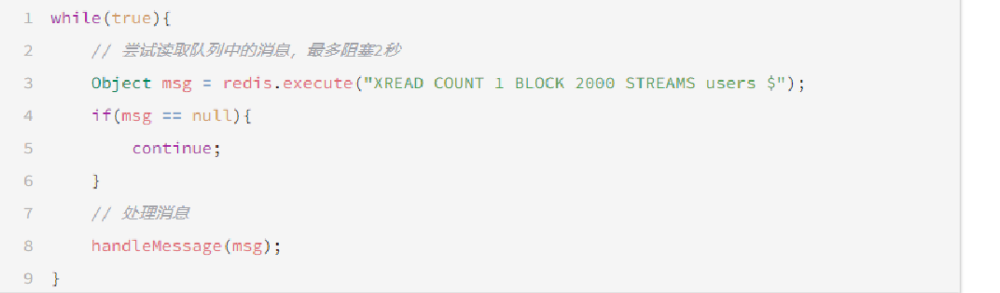

### 实战篇

#### 商品查询缓存

##### 添加缓存

**核心：**先查缓存，缓存没有再查数据库。查数据库后及时更新缓存。

##### 更新缓存

**核心：**先修改数据库，再删除缓存。

##### 缓存穿透

**原因：**查询的数据在缓存和数据库中都没有，请求就全部打到数据库。

| 解决方案   | 优点                    | 缺点                                       |
| ---------- | ----------------------- | ------------------------------------------ |
| 缓存空对象 | 实现简单，维护方便      | 额外内存消耗、可能造成短期的数据不一致问题 |
| 布隆过滤   | 内存占用少，没有多余key | 实现复杂、存在误判的可能                   |

##### 缓存击穿

**原因：**一个被高并发访问并且缓存重建业务较复杂的key突然失效了，无数的请求会在瞬间打到数据库。

| 解决方案 | 优点                                   | 缺点                                     |
| -------- | -------------------------------------- | ---------------------------------------- |
| 互斥锁   | 没有额外内存消耗、保证一致性、实现简单 | 线程需要等待、性能受到影响、会有死锁风险 |
| 逻辑过期 | 线程无需等待，性能较好                 | 不保证一致性、额外内存消耗、实现复杂     |

##### 缓存雪崩

**原因：**同一时段大量的缓存key同时失效或者redis服务宕机，导致大量请求打到数据库。

**解决方案：**给不同的key的TTL添加随机值、使用redis集群提高服务可用性。

#### 优惠券秒杀

##### 全局唯一ID

当用户抢购优惠券时，会生成订单并保存到tb_voucher_order这张表中，而订单表如果使用数据库自增ID就会存在一些问题：

**ID的规律性太明显。**

**受单表数据量的限制。**

我们可基于Redis实现**全局唯一ID生成器**，用于分布式系统下生成唯一ID。

```java
@Component
public class RedisIdWorker {

    /**
     * 起始的时间戳
     */
    private static final long BEGIN_TIMESTAMP = 1640995200L;
    /**
     * 序列号的位数
     */
    private static final int COUNT_BITS = 32;

    private StringRedisTemplate stringRedisTemplate;

    public RedisIdWorker(StringRedisTemplate stringRedisTemplate) {
        this.stringRedisTemplate = stringRedisTemplate;
    }

    public long nextId(String keyPrefix) {
        // 1、生成时间戳
        LocalDateTime now = LocalDateTime.now();
        long nowSecond = now.toEpochSecond(ZoneOffset.UTC);
        long timestamp = nowSecond - BEGIN_TIMESTAMP;

        // 2、生成序列号
        // 2.1、获取当前日期，精确到天
        String date = now.format(DateTimeFormatter.ofPattern("yyyy:MM:dd"));
        // 2.2、自增长
        long count = stringRedisTemplate.opsForValue().increment("icr:" + keyPrefix + ":" + date);

        // 3、拼接并返回
        return timestamp << COUNT_BITS | count;
    }

}
```

##### 超卖问题

超卖问题分析：原有代码中是这样写的：

```java
if (voucher.getStock() < 1) {
    // 库存不足
    return Result.fail("库存不足！");
}
//5，扣减库存
boolean success = seckillVoucherService.update()
        .setSql("stock= stock -1")
        .eq("voucher_id", voucherId).update();
if (!success) {
    //扣减库存
    return Result.fail("库存不足！");
}
```

假设线程1过来查询库存，判断出来库存大于1，正准备去扣减库存，但是还没有来得及去扣减，此时线程2过来，线程2也去查询库存，发现这个数量一定也大于1，那么这两个线程都会去扣减库存，最终多个线程都会去扣减库存，此时就会出现库存的超卖问题。


超卖问题是典型的多线程安全问题，针对这一问题的常见解决方案就是加锁：而对于加锁，我们通常有两种解决方案


使用乐观锁解决超卖问题，乐观锁常用的两种实现：1-数据版本（Version）记录比较，2-时间戳记录比较。

**修改代码方案一：**

VoucherOrderServiceImpl在扣减库存时，改为：

```java
boolean success = seckillVoucherService.update()
            .setSql("stock= stock -1") //set stock = stock -1
            .eq("voucher_id", voucherId).eq("stock",voucher.getStock()).update(); //where id = ？ and stock = ?
```

以上逻辑的核心含义是：只要我扣减库存时的库存和之前我查询到的库存是一样的，就意味着没有人在中间修改过库存，那么此时就是安全的。但是以上这种方式通过测试发现会有很多失败的情况，失败的原因在于：在使用乐观锁过程中假设100个线程同时都拿到了100的库存，然后大家一起去进行扣减，但是100个人中只有1个人能扣减成功，其他的人在处理时，他们在扣减时，库存已经被修改过了，所以此时其他线程都会失效。

**修改代码方案二：**

之前的方式要修改前后都保持一致，但是这样我们分析过，成功的概率太低，所以我们的乐观锁需要变一下，改成stock大于0 即可。

```java
boolean success = seckillVoucherService.update()
            .setSql("stock= stock -1")
            .eq("voucher_id", voucherId).update().gt("stock",0); //where id = ? and stock > 0
```

##### 一人一单

**需求：**修改秒杀业务，要求同一个优惠券，一个用户只能下一单。

**现在的问题：**优惠券是为了引流，但目前，一个人可以无限制抢这个优惠券，所以我们应当加一层逻辑，让一个用户对同一个优惠券只能下一个单。

**改进后逻辑：**判断秒杀活动是否开始，如果开始，则再判断库存是否充足，然后再根据优惠券id和用户id查询是否已经下过这个订单，若下过这个订单，则不再下单，否则进行下单操作。


**初步代码：增加一人一单逻辑**

```java
@Override
public Result seckillVoucher(Long voucherId) {
    // 1.查询优惠券
    SeckillVoucher voucher = seckillVoucherService.getById(voucherId);
    // 2.判断秒杀是否开始
    if (voucher.getBeginTime().isAfter(LocalDateTime.now())) {
        // 尚未开始
        return Result.fail("秒杀尚未开始！");
    }
    // 3.判断秒杀是否已经结束
    if (voucher.getEndTime().isBefore(LocalDateTime.now())) {
        // 尚未开始
        return Result.fail("秒杀已经结束！");
    }
    // 4.判断库存是否充足
    if (voucher.getStock() < 1) {
        // 库存不足
        return Result.fail("库存不足！");
    }
    // 5.一人一单逻辑
    // 5.1.用户id
    Long userId = UserHolder.getUser().getId();
    int count = query().eq("user_id", userId).eq("voucher_id", voucherId).count();
    // 5.2.判断是否存在
    if (count > 0) {
        // 用户已经购买过了
        return Result.fail("用户已经购买过一次！");
    }

    //6，扣减库存
    boolean success = seckillVoucherService.update()
            .setSql("stock= stock -1")
            .eq("voucher_id", voucherId).update();
    if (!success) {
        //扣减库存
        return Result.fail("库存不足！");
    }
    //7.创建订单
    VoucherOrder voucherOrder = new VoucherOrder();
    // 7.1.订单id
    long orderId = redisIdWorker.nextId("order");
    voucherOrder.setId(orderId);

    voucherOrder.setUserId(userId);
    // 7.3.代金券id
    voucherOrder.setVoucherId(voucherId);
    save(voucherOrder);

    return Result.ok(orderId);
}
```

**存在问题：**并发过来，查询数据库，都不存在订单，也会创建多个订单。所以我们还是需要加锁，但是乐观锁比较适合更新数据，现在是插入数据，所以我们需要使用悲观锁操作。

**添加锁：**初始方案是封装了一个createVoucherOrder方法，同时为了确保线程安全，在方法上添加一把synchronized锁。

```java
@Transactional
public synchronized Result createVoucherOrder(Long voucherId) {
	Long userId = UserHolder.getUser().getId();
         // 5.1.查询订单
        int count = query().eq("user_id", userId).eq("voucher_id", voucherId).count();
        // 5.2.判断是否存在
        if (count > 0) {
            // 用户已经购买过了
            return Result.fail("用户已经购买过一次！");
        }

        // 6.扣减库存
        boolean success = seckillVoucherService.update()
                .setSql("stock = stock - 1") // set stock = stock - 1
                .eq("voucher_id", voucherId).gt("stock", 0) // where id = ? and stock > 0
                .update();
        if (!success) {
            // 扣减失败
            return Result.fail("库存不足！");
        }

        // 7.创建订单
        VoucherOrder voucherOrder = new VoucherOrder();
        // 7.1.订单id
        long orderId = redisIdWorker.nextId("order");
        voucherOrder.setId(orderId);
        // 7.2.用户id
        voucherOrder.setUserId(userId);
        // 7.3.代金券id
        voucherOrder.setVoucherId(voucherId);
        save(voucherOrder);

        // 7.返回订单id
        return Result.ok(orderId);
}
```

**问题：**这样添加锁，锁的粒度太粗，使用锁的过程中，控制锁粒度是非常重要的。如果锁的粒度太大，会导致每个线程进来都会锁住，锁 粒度太小，可能锁不住。

**改进：**intern()这个方法是从常量池中拿到数据，如果我们直接使用userId.toString()他拿到的对象实际上是不同的对象，是new出来的对象。使用锁必须保证锁是同一把，所以我们需要使用intern()方法。

```java
@Transactional
public  Result createVoucherOrder(Long voucherId) {
	Long userId = UserHolder.getUser().getId();
	synchronized(userId.toString().intern()){
         // 5.1.查询订单
        int count = query().eq("user_id", userId).eq("voucher_id", voucherId).count();
        // 5.2.判断是否存在
        if (count > 0) {
            // 用户已经购买过了
            return Result.fail("用户已经购买过一次！");
        }

        // 6.扣减库存
        boolean success = seckillVoucherService.update()
                .setSql("stock = stock - 1") // set stock = stock - 1
                .eq("voucher_id", voucherId).gt("stock", 0) // where id = ? and stock > 0
                .update();
        if (!success) {
            // 扣减失败
            return Result.fail("库存不足！");
        }

        // 7.创建订单
        VoucherOrder voucherOrder = new VoucherOrder();
        // 7.1.订单id
        long orderId = redisIdWorker.nextId("order");
        voucherOrder.setId(orderId);
        // 7.2.用户id
        voucherOrder.setUserId(userId);
        // 7.3.代金券id
        voucherOrder.setVoucherId(voucherId);
        save(voucherOrder);

        // 7.返回订单id
        return Result.ok(orderId);
    }
}
```

但是以上代码还是存在问题，问题的原因在于当前方法被spring的事务控制，如果你在方法内部加锁，可能会导致当前方法事务还没有提交，但是锁已经释放也会导致问题，所以我们选择将当前方法整体包裹起来，确保事务不会出现问题，如下：

在seckillVoucher 方法中，添加以下逻辑，这样就能保证事务的特性，同时也控制了锁的粒度。


但是以上做法依然有问题，因为你调用的方法，其实是this.的方式调用的，事务想要生效，还得利用代理来生效，所以这个地方，我们需要获得原始的事务对象，来操作事务。


##### 问题：集群下的并发

通过加锁可以解决在单机情况下的一人一单安全问题，但是在集群模式下就不行了。

1、我们将服务启动两份，端口分别为8081和8082：


2、然后修改nginx的conf目录下的nginx.conf文件，配置反向代理和负载均衡：


**有关锁失效原因分析**

现在我们部署了多个tomcat，每个tomcat都有一个属于自己的jvm。那么假设在服务器A的tomcat内部，有两个线程，这两个线程由于使用的是同一份代码，那么他们的锁对象是同一个，是可以实现互斥的。但是现在服务器B的tomcat内部，又有两个线程，但是他们的锁对象写的虽然和服务器A一样，但是锁对象却不是同一个，所以线程3和线程4可以实现互斥，但是却无法和线程1和线程2实现互斥。这就是集群环境下，syn锁失效的原因，在这种情况下，我们就需要使用分布式锁来解决这个问题。


##### 方案：使用分布式锁

分布式锁：满足分布式系统或集群模式下多进程可见并且互斥的锁。

简易实现：基于Redis的setnx命令实现获取锁，del命令及expire命令实现锁释放。

一、初始版本分布式锁实现：

利用setnx方法进行加锁，同时增加过期时间，防止死锁，此方法可以保证加锁和增加过期时间具有原子性

```java
private static final String KEY_PREFIX="lock:"
@Override
public boolean tryLock(long timeoutSec) {
    // 获取线程标示
    String threadId = Thread.currentThread().getId()
    // 获取锁
    Boolean success = stringRedisTemplate.opsForValue()
            .setIfAbsent(KEY_PREFIX + name, threadId + "", timeoutSec, TimeUnit.SECONDS);
    return Boolean.TRUE.equals(success);
}
```

释放锁，防止删除别人的锁

```java
public void unlock() {
    //通过del删除锁
    stringRedisTemplate.delete(KEY_PREFIX + name);
}
```

修改业务代码

```java
@Override
public Result seckillVoucher(Long voucherId) {
    // 1.查询优惠券
    SeckillVoucher voucher = seckillVoucherService.getById(voucherId);
    // 2.判断秒杀是否开始
    if (voucher.getBeginTime().isAfter(LocalDateTime.now())) {
        // 尚未开始
        return Result.fail("秒杀尚未开始！");
    }
    // 3.判断秒杀是否已经结束
    if (voucher.getEndTime().isBefore(LocalDateTime.now())) {
        // 尚未开始
        return Result.fail("秒杀已经结束！");
    }
    // 4.判断库存是否充足
    if (voucher.getStock() < 1) {
        // 库存不足
        return Result.fail("库存不足！");
    }
    Long userId = UserHolder.getUser().getId();
    //创建锁对象(新增代码)
    SimpleRedisLock lock = new SimpleRedisLock("order:" + userId, stringRedisTemplate);
    //获取锁对象
    boolean isLock = lock.tryLock(1200);
    //加锁失败
    if (!isLock) {
        return Result.fail("不允许重复下单");
    }
    try {
        //获取代理对象(事务)
        IVoucherOrderService proxy = (IVoucherOrderService) AopContext.currentProxy();
        return proxy.createVoucherOrder(voucherId);
    } finally {
        //释放锁
        lock.unlock();
    }
}
```

问题：多线程时，其他线程删除了本线程持有的锁。

二、解决分布式锁误删问题：

核心逻辑：在存入锁时，放入自己线程的标识。在删除锁时，判断当前这把锁的标识是不是自己存入的，如果是，则进行删除，如果不是，则不进行删除。

加锁

```java
private static final String ID_PREFIX = UUID.randomUUID().toString(true) + "-";
@Override
public boolean tryLock(long timeoutSec) {
   // 获取线程标示
   String threadId = ID_PREFIX + Thread.currentThread().getId();
   // 获取锁
   Boolean success = stringRedisTemplate.opsForValue()
                .setIfAbsent(KEY_PREFIX + name, threadId, timeoutSec, TimeUnit.SECONDS);
   return Boolean.TRUE.equals(success);
}
```

释放锁

```java
public void unlock() {
    // 获取线程标示
    String threadId = ID_PREFIX + Thread.currentThread().getId();
    // 获取锁中的标示
    String id = stringRedisTemplate.opsForValue().get(KEY_PREFIX + name);
    // 判断标示是否一致
    if(threadId.equals(id)) {
        // 释放锁
        stringRedisTemplate.delete(KEY_PREFIX + name);
    }
}
```

问题：判断标识与锁释放操作是两步，非原子操作，高并发下可能会出现问题。

三、LUA脚本解决多条命令的原子性问题：

Redis提供的调用函数，语法如下：

```lua
redis.call('命令名称','key','其他参数',...)
```

例如，我们要执行set name jack，则脚本是这样：

```lua
-- 执行 set name jack
redis.call('set','name','jack')
```

例如，我们要先执行set name Rose，再执行get name，则脚本如下：

```lua
-- 先执行 set name jack
redis.call('set','name','Rose')
-- 再执行 get name
local name = redis.call('get','name')
-- 返回
return name
```

写好脚本以后，需要用Redis命令来调用脚本，调用脚本的常见命令如下：


例如，我们要执行 redis.call('set', 'name', 'jack') 这个脚本，语法如下：


如果脚本中的key、value不想写死，可以作为参数传递。key类型参数会放入KEYS数组，其它参数会放入ARGV数组，在脚本中可以从KEYS和ARGV数组获取这些参数：


最终我们操作redis的拿锁、比锁、删锁的lua脚本就会变成这样：

```lua
-- 这里的 KEYS[1] 就是锁的key，这里的ARGV[1] 就是当前线程标示
-- 获取锁中的标示，判断是否与当前线程标示一致
if (redis.call('GET', KEYS[1]) == ARGV[1]) then
  -- 一致，则删除锁
  return redis.call('DEL', KEYS[1])
end
-- 不一致，则直接返回
return 0
```

四、分布式锁改造

lua脚本本身并不需要大家花费太多时间去研究，只需要知道如何调用，大致是什么意思即可，所以在笔记中并不会详细的去解释这些lua表达式的含义。

我们的RedisTemplate中，可以利用execute方法去执行lua脚本，参数对应关系就如下图


Java代码，锁释放逻辑

```java
private static final DefaultRedisScript<Long> UNLOCK_SCRIPT;
    static {
        UNLOCK_SCRIPT = new DefaultRedisScript<>();
        UNLOCK_SCRIPT.setLocation(new ClassPathResource("unlock.lua"));
        UNLOCK_SCRIPT.setResultType(Long.class);
    }

public void unlock() {
    // 调用lua脚本
    stringRedisTemplate.execute(
            UNLOCK_SCRIPT,
            Collections.singletonList(KEY_PREFIX + name),
            ID_PREFIX + Thread.currentThread().getId());
}
// 经过以上代码改造后，我们就能够实现 拿锁比锁删锁的原子性动作了~
```

##### 最终方案：Redisson

Redisson是一个在Redis的基础上实现的Java驻内存数据网格（In-Memory Data Grid）。它不仅提供了一系列的分布式的Java常用对象，还提供了许多分布式服务。其中就包含了各种分布式锁的实现。

一、基于SETNX实现的分布式锁存在以下问题：

**重入问题：**重入问题是指获得锁的线程可以再次进入到相同的锁的代码块中，可重入锁的意义在于 防止死锁，比如HashTable这样的代码中，它的方法都是使用synchronized修饰的，假如它在一个方法内，调用另一个方法，那么此时如果是不可重入的，不就死锁了吗？所以可重入锁的主要意义是防止死锁，我们的synchronized和lock锁都是可重入的。

**不可重试：**是指目前的获取分布式锁只能尝试一次，我们认为合理的情况是：当线程在获得锁失败后，它应当能再次尝试获得锁。

**超时释放：**我们在加锁时增加了过期时间，这样我们可以防止死锁，但是如果卡顿的时间超长，虽然我们采用了lua脚本防止删锁的时候，误删别的线程的锁，但是毕竟没有锁住，有安全隐患。

**主从一致性：**如果Redis提供了主从集群，当我们向集群写数据时，主机异步的将数据同步给从机，如果在同步过去之前，主机宕机了，就会出现死锁问题。

二、分布式锁最终解决方案：使用Redisson锁：

引入依赖：

```xml
<!--redisson-->
<dependency>
    <groupId>org.redisson</groupId>
    <artifactId>redisson</artifactId>
    <version>3.13.6</version>
</dependency>
```

配置Redisson客户端：

```java
@Configuration
public class RedissonConfig {

    @Bean
    public RedissonClient redissonClient() {
        // 配置
        Config config = new Config();
        config.useSingleServer().setAddress("redis://192.168.88.114:6379").setPassword("123456");
        // 创建RedissonClient对象
        return Redisson.create(config);
    }

}
```

如何使用Redisson的分布式锁：

```java
@Resource
private RedissionClient redissonClient;

@Test
void testRedisson() throws Exception{
    //获取锁(可重入)，指定锁的名称
    RLock lock = redissonClient.getLock("anyLock");
    //尝试获取锁，参数分别是：获取锁的最大等待时间(期间会重试)，锁自动释放时间，时间单位
    boolean isLock = lock.tryLock(1,10,TimeUnit.SECONDS);
    //判断获取锁成功
    if(isLock){
        try{
            System.out.println("执行业务");          
        }finally{
            //释放锁
            lock.unlock();
        }
        
    }    
}
```

在VoucherOrderServiceImpl注入RedissonClient：

```java
@Resource
RedissonClient redissonClient;

@Override
public Result seckillVoucher(Long voucherId) {
    // 1、查询优惠券
    SeckillVoucher voucher = seckillVoucherService.getById(voucherId);
    // 2、判断秒杀是否开始
    if (voucher.getBeginTime().isAfter(LocalDateTime.now())) {
        // 尚未开始
        return Result.fail("秒杀尚未开始！");
    }
    // 3、判断秒杀是否已经结束
    if (voucher.getEndTime().isBefore(LocalDateTime.now())) {
        // 秒杀已经结束
        return Result.fail("秒杀已经结束！");
    }
    // 4、判断库存是否充足
    if (voucher.getStock() < 1) {
        // 库存不足
        return Result.fail("库存不足！");
    }
    Long userId = UserHolder.getUser().getId();
    // 创建锁对象
    // SimpleRedisLock lock = new SimpleRedisLock("order:" + userId, stringRedisTemplate);
    RLock lock = redissonClient.getLock("lock:order:" + userId);
    // 获取锁
    boolean isLock = lock.tryLock();
    // 判断是否获取锁成功
    if (!isLock) {
        // 获取锁失败，返回错误或者重试
        return Result.fail("不允许重复下单！");
    }
    try {
        // 获取代理对象（事务）
        IVoucherOrderService proxy = (IVoucherOrderService) AopContext.currentProxy();
        return proxy.createVoucherOrder(voucherId);
    } finally {
        // 释放锁
        lock.unlock();
    }
}
```

##### 秒杀优化：异步下单

**一、我们来回顾一下下单流程：**

当用户发起请求，此时会请求nginx，nginx会访问到tomcat，而tomcat中的程序，会进行串行操作，分成如下几个步骤：

1、查询优惠券

2、判断秒杀库存是否足够

3、查询订单

4、校验是否是一人一单

5、扣减库存

6、创建订单

问题：在这六步操作中，又有很多操作是要去操作数据库的，而且还是在一个线程内串行执行，这样就会导致我们的程序执行的很慢。

方案：关键数据保存至redis，lua脚本判断秒杀是否成功，开启异步线程完成秒杀成功用户的下单功能。

- 新增秒杀优惠券的同时，将优惠券信息保存到Redis中
- 基于Lua脚本，判断秒杀库存、一人一单、决定用户是否抢购成功
- 如果抢购成功，将优惠券id和用户id封装后存入阻塞队列
- 开启线程任务，不断从阻塞队列中获取信息，实现异步下单功能

**二、Redis消息队列-基于Stream的消息队列**

Stream 是 Redis 5.0 引入的一种新数据类型，可以实现一个功能非常完善的消息队列。

发送消息的命令：


例如：


读取消息的方式之一：XREAD


例如，使用XREAD读取第一个消息：


XREAD阻塞方式，读取最新的消息：


在业务开发中，我们可以循环的调用XREAD阻塞方式来查询最新消息，从而实现持续监听队列的效果，伪代码如下



注意：当我们指定起始ID为$时，代表读取最新的消息，如果我们处理一条消息的过程中，又有超过1条以上的消息到达队列，则下次获取时也只能获取到最新的一条，会出现漏读消息的问题

STREAM类型消息队列的XREAD命令特点：

* 消息可回溯
* 一个消息可以被多个消费者读取
* 可以阻塞读取
* 有消息漏读的风险

**消费者组**

消费者组（Consumer Group）：将多个消费者划分到一个组中，监听同一个队列。具备下列特点：


创建消费者组：


key：队列名称
groupName：消费者组名称
ID：起始ID标示，$代表队列中最后一个消息，0则代表队列中第一个消息
MKSTREAM：队列不存在时自动创建队列
其它常见命令：

**删除指定的消费者组**

```java
XGROUP DESTORY key groupName
```

 **给指定的消费者组添加消费者**

```java
XGROUP CREATECONSUMER key groupname consumername
```

 **删除消费者组中的指定消费者**

```java
XGROUP DELCONSUMER key groupname consumername
```

从消费者组读取消息：

```java
XREADGROUP GROUP group consumer [COUNT count] [BLOCK milliseconds] [NOACK] STREAMS key [key ...] ID [ID ...]
```

* group：消费组名称
* consumer：消费者名称，如果消费者不存在，会自动创建一个消费者
* count：本次查询的最大数量
* BLOCK milliseconds：当没有消息时最长等待时间
* NOACK：无需手动ACK，获取到消息后自动确认
* STREAMS key：指定队列名称
* ID：获取消息的起始ID：

">"：从下一个未消费的消息开始
其它：根据指定id从pending-list中获取已消费但未确认的消息，例如0，是从pending-list中的第一个消息开始

消费者监听消息的基本思路：


STREAM类型消息队列的XREADGROUP命令特点：

* 消息可回溯
* 可以多消费者争抢消息，加快消费速度
* 可以阻塞读取
* 没有消息漏读的风险
* 有消息确认机制，保证消息至少被消费一次

最后我们来个小对比


**三、最终实现（基于Redis的Stream结构作为消息队列，实现异步秒杀下单）**

lua脚本，仅操作redis数据。

秒杀成功判断（库存，一人一单），扣减库存（库存量-1）、保存已下单用户（避免一人多单）、发消息至队列（异步任务读取消息去真正创建订单）。

```lua
-- 1、参数列表
-- 1.1、优惠券id
local voucherId = ARGV[1]
-- 1.2、用户id
local userId = ARGV[2]
-- 1.3、订单id
local orderId = ARGV[3]

-- 2、数据key
-- 2.1、库存key
local stockKey = "seckill:stock:" .. voucherId
-- 2.2、订单key
local orderKey = "seckill:order:" .. voucherId

-- 3、脚本业务
-- 3.1、判断库存是否充足 get stockKey
if (tonumber(redis.call("get", stockKey)) <= 0) then
    -- 库存不足，返回1
    return 1
end
-- 3.2、判断用户是否下单 sismember orderKey userId
if (redis.call("sismember", orderKey, userId) == 1) then
    -- 存在，说明是重复下单，返回2
    return 2
end
-- 3.3、扣库存 incrby stockKey -1
redis.call("incrby", stockKey, -1)
-- 3.4、下单（保存用户）sadd orderKey userId
redis.call("sadd", orderKey, userId)
-- 3.5、发送消息到队列中，xadd stream.orders * k1 v1 k2 v2 ...
redis.call("xadd", "stream.orders", "*", "userId", userId, "voucherId", voucherId, "id", orderId)
-- 3.6、返回0，成功
return 0
```

java代码，根据lua脚本的执行结果给用户响应（此时并没有真正的创建订单）。

```java
@Override
public Result seckillVoucher(Long voucherId) {
    // 获取用户
    Long userId = UserHolder.getUser().getId();
    // 获取订单id
    long orderId = redisIdWorker.nextId("order");
    // 1、执行lua脚本
    Long result = stringRedisTemplate.execute(
            SECKILL_SCRIPT,
            Collections.emptyList(),
            voucherId.toString(), userId.toString(), String.valueOf(orderId)
    );
    // 2、判断结果是否为0
    int r = result.intValue();
    if (r != 0) {
        // 不为0，代表没有购买资格
        return Result.fail(r == 1 ? "库存不足" : "不能重复下单");
    }
    // 3、获取代理对象
    proxy = (IVoucherOrderService) AopContext.currentProxy();
    // 4、返回订单id
    return Result.ok(orderId);
}
```

java代码，异步任务创建订单。读取消息队列消息、解析数据、创建订单、确认消息。

```java
private class VoucherOrderHandler implements Runnable {
    String queueName = "stream.orders";

    @Override
    public void run() {
        while (true) {
            try {
                // 1、获取消息队列中的订单信息 xreadgroup group g1 c1 count 1 block 2000 streams streams.order >
                List<MapRecord<String, Object, Object>> list = stringRedisTemplate.opsForStream().read(
                        Consumer.from("g1", "c1"),
                        StreamReadOptions.empty().count(1).block(Duration.ofSeconds(2)),
                        StreamOffset.create(queueName, ReadOffset.lastConsumed())
                );
                // 2、判断消息获取是否成功
                if (list == null || list.isEmpty()) {
                    // 如果获取失败，说明没有消息，继续下一次循环
                    continue;
                }
                // 3、解析消息中的订单信息
                MapRecord<String, Object, Object> record = list.get(0);
                Map<Object, Object> values = record.getValue();
                VoucherOrder voucherOrder = BeanUtil.fillBeanWithMap(values, new VoucherOrder(), true);
                // 4、如果获取成功，可以下单，创建订单
                handleVoucherOrder(voucherOrder);
                // 5、ACK确认 xack stream.orders g1 id
                stringRedisTemplate.opsForStream().acknowledge(queueName, "g1", record.getId());
            } catch (Exception e) {
                log.error("处理订单异常", e);
                handlePendingList();
            }
        }
    }

    private void handlePendingList() {
        while (true) {
            try {
                // 1、获取pending-list中的订单信息 xreadgroup group g1 c1 count 1 streams streams.order 0
                List<MapRecord<String, Object, Object>> list = stringRedisTemplate.opsForStream().read(
                        Consumer.from("g1", "c1"),
                        StreamReadOptions.empty().count(1),
                        StreamOffset.create(queueName, ReadOffset.from("0"))
                );
                // 2、判断消息获取是否成功
                if (list == null || list.isEmpty()) {
                    // 如果获取失败，说明pending-list没有异常消息，结束循环
                    break;
                }
                // 3、解析消息中的订单信息
                MapRecord<String, Object, Object> record = list.get(0);
                Map<Object, Object> values = record.getValue();
                VoucherOrder voucherOrder = BeanUtil.fillBeanWithMap(values, new VoucherOrder(), true);
                // 4、如果获取成功，可以下单，创建订单
                handleVoucherOrder(voucherOrder);
                // 5、ACK确认 xack stream.orders g1 id
                stringRedisTemplate.opsForStream().acknowledge(queueName, "g1", record.getId());
            } catch (Exception e) {
                log.error("处理pending-list订单异常", e);
                try {
                    Thread.sleep(20);
                } catch (InterruptedException ex) {
                    throw new RuntimeException(ex);
                }
            }
        }
    }
}
```

#### 达人探店

##### 发布探店笔记

发布探店笔记

探店笔记类似点评网站的评价，往往是图文结合。对应的表有两个：
tb_blog：探店笔记表，包含笔记中的标题、文字、图片等
tb_blog_comments：其他用户对探店笔记的评价

**具体发布流程**


上传接口

```java
@Slf4j
@RestController
@RequestMapping("upload")
public class UploadController {

    @PostMapping("blog")
    public Result uploadImage(@RequestParam("file") MultipartFile image) {
        try {
            // 获取原始文件名称
            String originalFilename = image.getOriginalFilename();
            // 生成新文件名
            String fileName = createNewFileName(originalFilename);
            // 保存文件
            image.transferTo(new File(SystemConstants.IMAGE_UPLOAD_DIR, fileName));
            // 返回结果
            log.debug("文件上传成功，{}", fileName);
            return Result.ok(fileName);
        } catch (IOException e) {
            throw new RuntimeException("文件上传失败", e);
        }
    }

}
```

注意：同学们在操作时，需要修改SystemConstants.IMAGE_UPLOAD_DIR 自己图片所在的地址，在实际开发中图片一般会放在nginx上或者是云存储上。

BlogController

```java
@RestController
@RequestMapping("/blog")
public class BlogController {

    @Resource
    private IBlogService blogService;

    @PostMapping
    public Result saveBlog(@RequestBody Blog blog) {
        // 获取登录用户
        UserDTO user = UserHolder.getUser();
        blog.setUserId(user.getId());
        // 保存探店博文
        blogService.save(blog);
        // 返回id
        return Result.ok(blog.getId());
    }
    
}
```

##### 查看探店笔记

实现查看发布探店笔记的接口


实现代码：

BlogServiceImpl

```java
@Override
public Result queryBlogById(Long id) {
    // 1.查询blog
    Blog blog = getById(id);
    if (blog == null) {
        return Result.fail("笔记不存在！");
    }
    // 2.查询blog有关的用户
    queryBlogUser(blog);
  
    return Result.ok(blog);
}
```

##### 点赞探店笔记

利用Redis的SET集合，判断某探店笔记当前登录用户是否点赞过

初始代码

```java
@GetMapping("/likes/{id}")
public Result queryBlogLikes(@PathVariable("id") Long id) {
    //修改点赞数量
    blogService.update().setSql("liked = liked +1 ").eq("id",id).update();
    return Result.ok();
}
```

问题分析：这种方式会导致一个用户无限点赞，明显是不合理的

造成这个问题的原因是，我们现在的逻辑，发起请求只是给数据库+1，所以才会出现这个问题


完善点赞功能

需求：

* 同一个用户只能点赞一次，再次点击则取消点赞
* 如果当前用户已经点赞，则点赞按钮高亮显示（前端已实现，判断字段Blog类的isLike属性）

实现步骤：

* 给Blog类中添加一个isLike字段，标示是否被当前用户点赞
* 修改点赞功能，利用Redis的set集合判断是否点赞过，未点赞过则点赞数+1，已点赞过则点赞数-1
* 修改根据id查询Blog的业务，判断当前登录用户是否点赞过，赋值给isLike字段
* 修改分页查询Blog业务，判断当前登录用户是否点赞过，赋值给isLike字段

为什么采用set集合：

因为我们的数据是不能重复的，当用户操作过之后，无论他怎么操作，都是

具体步骤：

1、在Blog 添加一个字段

```java
@TableField(exist = false)
private Boolean isLike;
```

2、修改代码

```java
@Override
public Result likeBlog(Long id) {
    // 1、获取登录用户
    Long userId = UserHolder.getUser().getId();
    // 2、判断当前登录用户是否已经点赞
    String key = "blog:liked:" + id;
    Boolean isMember = stringRedisTemplate.opsForSet().isMember(key, userId.toString());
    if (BooleanUtil.isFalse(isMember)) {
        // 3、如果未点赞，则可以点赞
        // 3.1、数据库点赞数+1
        boolean isSuccess = update().setSql("liked = liked + 1").eq("id", id).update();
        // 3.2、保存用户到Redis的Set集合
        if (isSuccess) {
            stringRedisTemplate.opsForSet().add(key, userId.toString());
        }
    } else {
        // 4、如果已经点赞，则取消点赞
        // 4.1、数据库点赞数-1
        boolean isSuccess = update().setSql("liked = liked - 1").eq("id", id).update();
        // 4.2、从Redis的Set集合移除用户
        if (isSuccess) {
            stringRedisTemplate.opsForSet().remove(key, userId.toString());
        }
    }
    return Result.ok();
}
```

